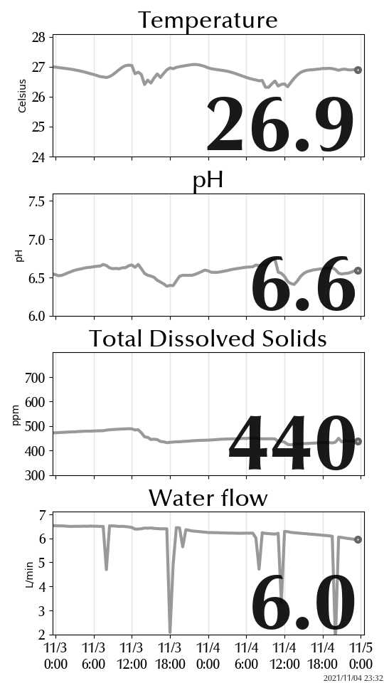

# m5paper-aqua

## 概要

InfludDB に蓄えた水槽のセンシングデータを，電子ペーパー(M5Paper)に表示するためのスクリプトです．

表示サンプルは下記になります．

## 構成

次の2つから構成されています．

- InfluxDB のデータから RAW4 の画像を生成して HTTP で配信するサーバ
- 上記サーバから定期的に画像を取得して表示するクライアント

## 備考

塩宇RAW4 で画像データをやりとりしているのは，クライアントの消費電力低
減が目的になります．しかし，shutdown を使って極力電源遮断するようにし
ても，30分毎の更新だとバッテリーが一ヶ月持たなかったので実運用では常時
電源供給して使っています．
